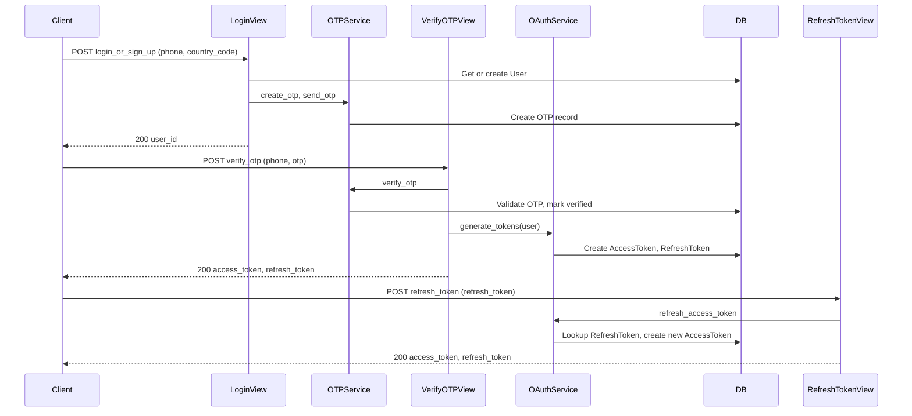

# olmachine_users

# Name
olmachine_users

# Responsibility
`olmachine_users` is the **authentication and user-identity** app for the OldMachine marketplace backend.

**What it does:**
- Manages user identity (phone-based and username-based users)
- Handles login/sign-up initiation (send OTP to phone)
- Verifies OTP and issues OAuth2 access and refresh tokens
- Exchanges refresh tokens for new access tokens
- Stores and validates OTPs with expiry

**What it does NOT do:**
- Does not own product or category data (that's in `olmachine_products`)
- Does not own seller profiles or seller product listings (that's in `olmachine_seller_portal`)
- Does not implement SMS delivery (OTP send is mock/configurable; actual SMS is external)

# Big Picture: How This Works

## The Problem We're Solving
Users (buyers and sellers) need to:
1. Sign up or log in using a phone number (no password initially)
2. Receive an OTP and verify it to prove ownership of the phone
3. Get an access token to call protected APIs (marketplace, seller portal)
4. Refresh the access token when it expires without re-entering OTP

**Challenges:**
- Phone number is the primary identifier; we need OTP verification
- Tokens must be OAuth2-compatible (django-oauth-toolkit) for API auth
- Refresh flow must not require client_id/client_secret for simple mobile/web clients

**Solution:**
`olmachine_users` owns the full auth flow: request OTP → verify OTP → get tokens → refresh tokens. It uses django-oauth-toolkit under the hood for AccessToken and RefreshToken storage and issues tokens via a custom service so that verify_otp and refresh_token APIs do not require client credentials.

## Architecture Overview

# Key Entities

## User
**What it is:** Custom user model (Django AbstractBaseUser). Can be identified by `phone_number` (marketplace users) or `username` (admin/superuser).

**Problem it solves:** Single identity store for both phone-based buyers/sellers and staff accounts.

**Key fields:**
- `id` (UUID), `phone_number`, `country_code`, `username`
- `is_active`, `is_staff`, `is_superuser`
- Constraint: at least one of `username` or `phone_number` must be set

**Used by:** All three auth endpoints; seller portal checks user for SellerProfile link.

---

## OTP
**What it is:** One-time password record for a phone number, tied to a user.

**Problem it solves:** Time-limited verification of phone ownership before issuing tokens.

**Key fields:**
- `user` (FK), `phone_number`, `otp_code`, `is_verified`, `expires_at`
- Indexes on `(phone_number, otp_code)` and `expires_at`

**Lifecycle:** Created by login_or_sign_up; verified by verify_otp (checks expiry and marks verified). Not reused.

---

## AccessToken / RefreshToken (django-oauth-toolkit)
**What it is:** OAuth2 tokens stored in the project via `oauth2_provider`. Application and tokens are created per user by `OAuthService`.

**Problem it solves:** Stateless API authentication; refresh allows new access token without OTP again.

**Flow:** `generate_tokens(user)` creates one Application per user (if not exists), removes old tokens for that app, creates new AccessToken and RefreshToken. `refresh_access_token(refresh_token_string)` finds the RefreshToken, creates a new AccessToken, revokes the old one, and links the RefreshToken to the new AccessToken so the same refresh token can be used again.

# Complete User Journeys

## Flow 1: First-Time Login (Send OTP)
**User story:** User enters phone number and requests OTP.

**Steps:**
1. Client sends `POST /api/marketplace/login_or_sign_up/v1/` with `phone_number`, `country_code`.
2. Serializer validates phone number and country code.
3. System gets or creates `User` by phone_number; updates country_code if changed.
4. `OTPService.create_otp(user, phone_number)` creates an OTP record with expiry.
5. `OTPService.send_otp(otp)` sends OTP (mock or configured SMS); on failure returns 400.
6. Returns 200 with `user_id` (and message that OTP was sent). In beta, OTP may be logged server-side.

**Why this matters:** Single entry point for both new and returning users; no password; OTP is the first factor.

---

## Flow 2: Verify OTP and Get Tokens
**User story:** User enters OTP received on phone and gets access + refresh tokens.

**Steps:**
1. Client sends `POST /api/marketplace/verify_otp/v1/` with `phone_number`, `otp`.
2. Serializer validates format; `OTPService.verify_otp(phone_number, otp_code)` checks OTP exists, not expired, and marks it verified.
3. User is fetched by phone_number.
4. `OAuthService.generate_tokens(user)` creates or reuses Application for user, deletes any existing AccessToken/RefreshToken for that application, creates new AccessToken and RefreshToken.
5. Returns 200 with `access_token` and `refresh_token` (same shape as refresh API). Client stores both; access_token is used in `Authorization: Bearer <access_token>` for protected APIs.

**Why this matters:** After this, user is “logged in”; all subsequent API calls use the access token until it expires.

---

## Flow 3: Refresh Access Token
**User story:** Access token expired; client uses refresh token to get a new access token without asking for OTP again.

**Steps:**
1. Client sends `POST /api/marketplace/refresh_token/v1/` with body `{ "refresh_token": "<string>" }`.
2. Serializer validates presence of `refresh_token`.
3. `OAuthService.refresh_access_token(refresh_token_string)` looks up RefreshToken by token and `revoked__isnull=True`; if not found raises ValueError.
4. Creates new AccessToken for same user/application; revokes (deletes) old AccessToken; updates RefreshToken to point to new AccessToken; returns new access_token and same refresh_token.
5. Returns 200 with `access_token` and `refresh_token`. On invalid/expired/revoked refresh token returns 400 with `res_status: "INVALID_REFRESH_TOKEN"`.

**Why this matters:** Seamless session extension without re-verifying phone; no client_id/client_secret required.

# Public HTTP APIs

All endpoints live under **`/api/marketplace/`** (project urls include `olmachine_users.urls` under that prefix).

## Login or Sign Up
- **Endpoint:** `POST /api/marketplace/login_or_sign_up/v1/`
- **Auth:** None (AllowAny)
- **Request body:** `{ "phone_number": "10-digit string", "country_code": "+91" }`
- **Success (200):** `{ "user_id": "uuid" }` (and optional message). OTP is sent; in beta, OTP may be logged on server.
- **Error (400):** Invalid phone number or country code; or OTP send failed.

---

## Verify OTP
- **Endpoint:** `POST /api/marketplace/verify_otp/v1/`
- **Auth:** None (AllowAny)
- **Request body:** `{ "phone_number": "10-digit string", "otp": "otp_code" }`
- **Success (200):** `{ "access_token": "...", "refresh_token": "..." }`
- **Error (400):** Invalid or expired OTP; user not found; or verification failed.

---

## Refresh Token
- **Endpoint:** `POST /api/marketplace/refresh_token/v1/`
- **Auth:** None (AllowAny)
- **Request body:** `{ "refresh_token": "string from verify_otp" }`
- **Success (200):** `{ "access_token": "...", "refresh_token": "..." }`
- **Error (400):** Missing refresh_token (validation) or invalid/expired/revoked refresh token (`res_status: "INVALID_REFRESH_TOKEN"`).

# Data Layer (Database Models)

## User
- **Table:** `users`
- **Fields:** id (UUID), username (nullable, unique), phone_number (nullable, unique), country_code, is_active, is_staff, is_superuser, created_at, updated_at
- **Constraint:** At least one of username or phone_number must be non-null.

## OTP
- **Table:** `otps`
- **Fields:** id (UUID), user_id (FK), phone_number, otp_code, is_verified, expires_at, created_at
- **Indexes:** (phone_number, otp_code), expires_at

## OAuth2 (oauth2_provider)
- **Tables:** Applications and tokens are in oauth2_provider tables; created/managed by `OAuthService` per user. Not documented in full here; see django-oauth-toolkit.

# Module Dependencies

## Internal (Django apps in project)
- **oldmachine_backend.utils.response_utils:** `success_response`, `error_response` for consistent API response format.
- **oauth2_provider:** Application, AccessToken, RefreshToken models and settings (e.g. ACCESS_TOKEN_EXPIRE_SECONDS).

## External
- **python-dotenv:** Load .env for local config (in settings).
- **django-oauth-toolkit / oauthlib:** Token generation and storage.

# Important Business Rules

- **OTP expiry:** OTPs have an expiry time; verify_otp checks it and rejects expired OTPs.
- **One active token set per user:** `generate_tokens` deletes existing AccessToken (and associated RefreshToken) for the user’s application before creating new ones, so only one valid access/refresh pair per user at a time (per application).
- **Refresh token reuse:** The same refresh token string is returned after refresh; the underlying RefreshToken row is updated to point to the new AccessToken. Revoked or unknown refresh tokens return 400.
- **401 vs 403:** Invalid or missing Bearer token on protected endpoints (in other apps) typically returns 401; valid user but insufficient permission (e.g. not a seller) returns 403.

# Summary

`olmachine_users` provides phone-based authentication and OAuth2-style tokens for the OldMachine backend. It handles login/sign-up (OTP send), OTP verification (token issue), and refresh token exchange. It does not own seller or product data; it only identifies the user and issues tokens used by `olmachine_products` and `olmachine_seller_portal`.

**For new developers:** Trace the flow from login_or_sign_up → verify_otp → refresh_token; then follow the access_token into marketplace and seller-portal views. Check `OAuthService` and `OTPService` for token and OTP logic.
